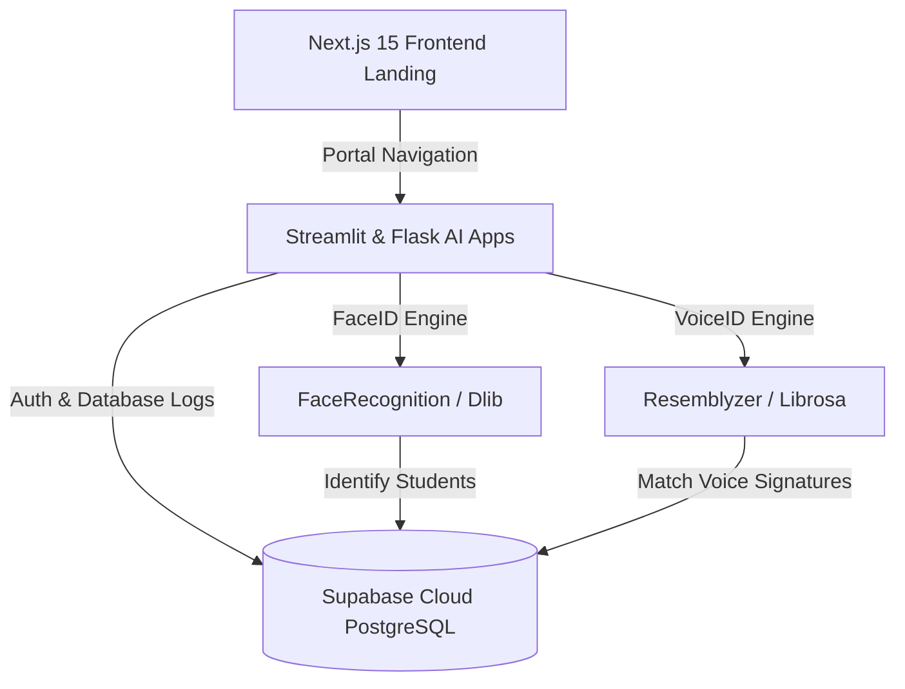

# 🏫 Smart Class: Next-Gen AI-Powered Biometric Attendance System

<div align="center">
  
  
  [](https://nextjs.org/)
  [](https://react.dev/)
  [](https://tailwindcss.com/)
  [](#)
  [](https://smart-class-attendance.vercel.app)
</div>

---

## 🌟 Overview

**Smart Class** is a state-of-the-art, next-generation attendance management system designed to bring speed, high-fidelity security, and effortless tracking to modern classrooms. By leveraging hybrid AI technologies—**FaceID** (Computer Vision) and **VoiceID** (Acoustic Biometrics)—Smart Class completely eliminates paper rosters, proxy attendance, and manual log-ins.

This repository hosts the Next.js landing page which acts as the visual flagship and portal for students and teachers. Under the hood, it links directly to our cloud-native Streamlit & Flask AI engine, communicating in real-time with our PostgreSQL infrastructure hosted on Supabase.

---

## 🛠️ Key Product Features

### 👨‍🏫 The Teacher's Journey
1. **Secure Login**: Access controls via high-grade authentication protocols.
2. **Unified Dashboard**: Manage classrooms, subjects, rosters, and live statistics in a singular view.
3. **Course Creator**: Launch new subjects instantly, automatically provisioning dedicated databases.
4. **FaceID Scanning**: Capture a single photo of the classroom. The AI-vision pipeline processes, aligns, detects, and logs all present students within milliseconds.
5. **VoiceID Roll-call**: An interactive audio loop. Students say *"Present"* sequentially, and the AI compares voice signatures against registered voice embeddings in real-time.
6. **Actionable Analytics**: Review high-fidelity confidence scores, update exceptions manually, and export logs to standardized CSV files.

### 🧑‍🎓 The Student's Journey
1. **QR Enrollment**: Scan unique, dynamic QR codes displayed by the teacher to join courses in seconds.
2. **One-Time Biometric Registration**: Securely register facial patterns and voice signatures.
3. **Personal Portal**: View individual attendance percentages, timelines, and course compliance scores across all enrolled subjects.

---

## 📐 System Architecture

Smart Class fuses top-tier web architectures with state-of-the-art Python artificial intelligence pipelines.



### 🧠 The Biometric AI Pipeline
* **FaceID Recognition**: Employs deep residual networks to compute 128-dimension face descriptors. Dlib performs HOG/CNN-based facial detection and affine transformation to correct head poses in varying lighting environments.
* **VoiceID Embedding Match**: Utilizes standard mel-spectrogram representations and deep LSTM networks (via Resemblyzer) to encode voice prints into 256-dimension voice embeddings, comparing similarity against reference prints in real-time.

---

## 💻 Technical Stack

| Category | Technology | Role / Component |
| :--- | :--- | :--- |
| **Frontend Framework** | **Next.js 15 & React 19** | Static & server rendering, dynamic routing, high-performance UI structure. |
| **Styling** | **Tailwind CSS v4** | Curated styling system with clean variables, flex/grid layouts. |
| **Animations** | **Framer Motion & Vanilla JS** | Dynamic page transitions, custom requestAnimationFrame loop for cinematic video. |
| **UI Aesthetics** | **Liquid Glass & Border Beam** | Elegant glassmorphism gradients and glowing animated border borders. |
| **AI Orchestration** | **Streamlit & Flask** | Low-latency reactive application servers powering biometric captures. |
| **Biometrics (Vision)**| **FaceRecognition & Dlib**| Image preprocessing, facial landmarks detection, facial mapping. |
| **Biometrics (Audio)** | **Resemblyzer & Librosa** | Voice feature extraction, vocal similarity detection, anti-spoofing. |
| **Database & Auth** | **Supabase Cloud (PostgreSQL)**| Storage of student records, biometric vectors, and authentication layers. |

---

## 🎨 Visual Premium Features

The landing page features high-end aesthetics curated to wow users upon their first visit:
* **Liquid Glass (`.liquid-glass`)**: Tailored glassmorphism effect using `backdrop-filter: blur`, combined with an dynamic SVG border linear-gradient mask simulating a luxury reflective sheen.
* **Border Beam (`BorderBeam`)**: Elegant CSS animation drawing a custom-colored, fast-moving laser beam tracing along the border path of glass panels.
* **Runtime Protection (`SafeSectionWrapper`)**: High-order Error Boundary system protecting the production site from crashing. Even if an animation or video element encounters a render error, the rest of the application remains fully interactive.
* **Cinematic Backgrounds**: Direct stream of ultra-smooth MP4 video loops, managed by custom vanilla JS requestAnimationFrame loop triggers to achieve smooth fadeIn/fadeOut transitions upon buffering.

---

## 🚀 Local Development

Follow these steps to run the landing portal locally.

### Prerequisites
* **Node.js** (v18.x or above recommended)
* **npm** (v9.x or above)

### Steps

1. **Clone the repository** (if not already done):
   ```bash
   git clone <repository-url>
   cd asme-landing-page
   ```

2. **Install all project dependencies**:
   ```bash
   npm install
   ```

3. **Configure Environment Variables**:
   * Copy the template file:
     ```bash
     cp .env.example .env.local
     ```
   * Set your required project keys in the newly created `.env.local` file.

4. **Launch the development server**:
   ```bash
   npm run dev
   ```

5. **Open the Localhost Stream**:
   Open [http://localhost:3000](http://localhost:3000) in your web browser to interact with the system.

---

## 👨‍💻 Developer Profile

Smart Class was fully designed, engineered, and shipped by **Ujjwal Sharma**. Feel free to explore his portfolio or reach out for inquiries:

* **Portfolio Website**: [ujjwal-sharma-dev.netlify.app](https://ujjwal-sharma-dev.netlify.app)
* **GitHub Profile**: [@us8024435-debug](https://github.com/us8024435-debug)
* **LinkedIn**: [Ujjwal Sharma on LinkedIn](https://www.linkedin.com/in/ujjwal-sharma-776832293)
* **Email Address**: [us5533400@gmail.com](mailto:us5533400@gmail.com)
* **Phone**: [+91 73510 57134](tel:7351057134)

---
<div align="center">
  <p font-mono text-xs>Designed & developed with ❤️ by Ujjwal Sharma &copy; 2026. All rights reserved.</p>
</div>
